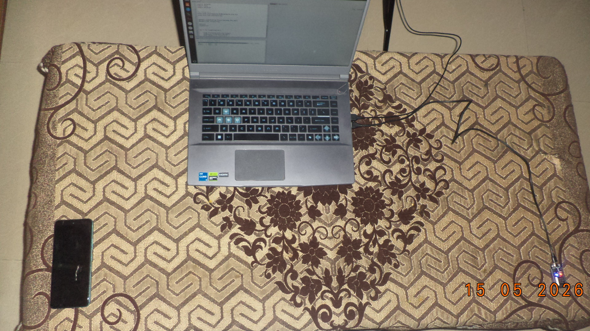
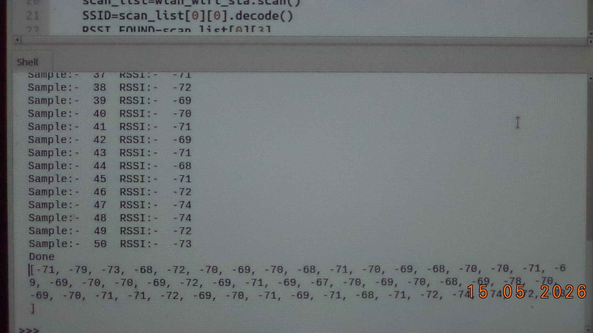
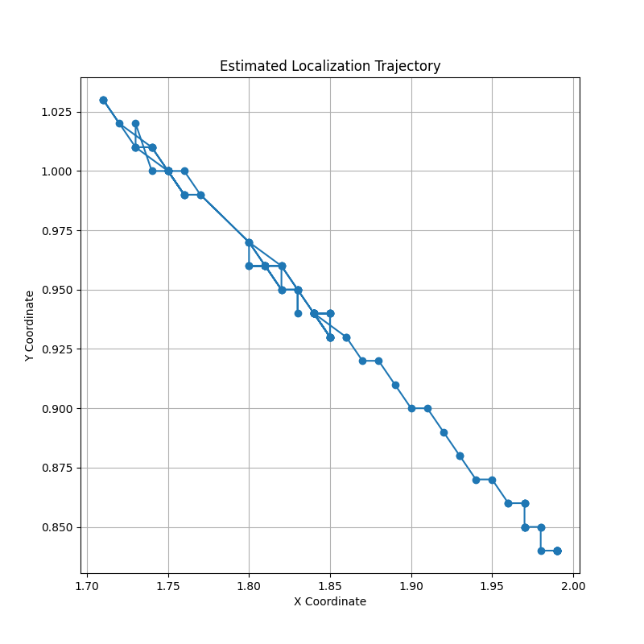
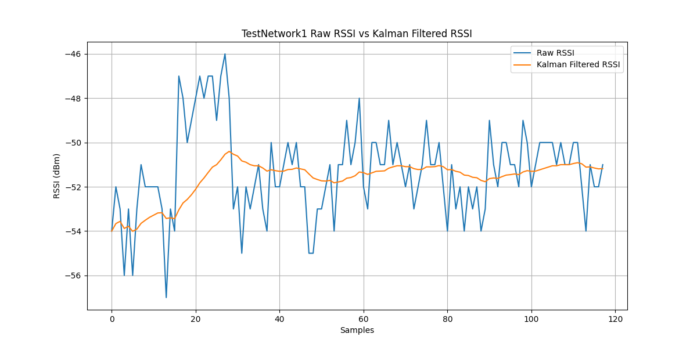
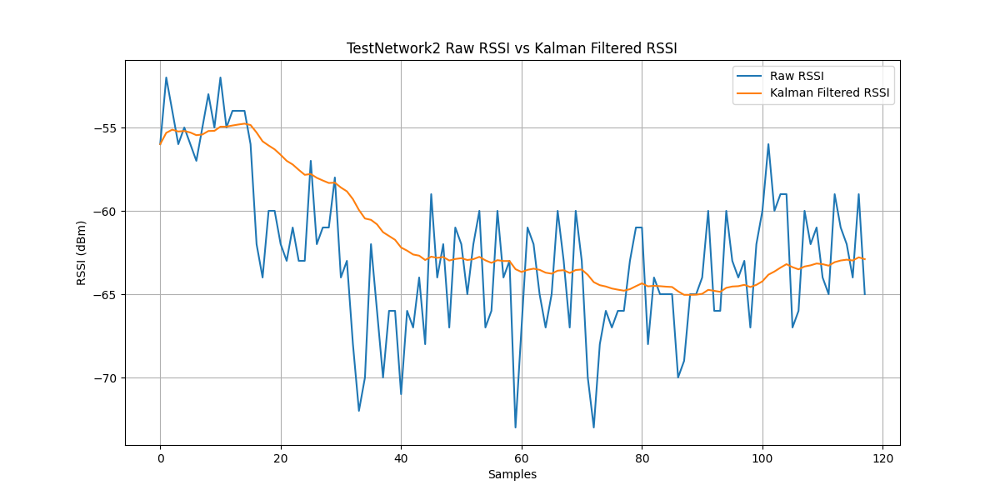

# Indoor Positioning System Application On ESP32

This project implements an indoor positioning system using three ESP32 anchor nodes and RSSI-based trilateration. The system estimates the position of a target ESP32 device by measuring Wi-Fi signal strength (RSSI) from multiple anchors.

The project also applies a Kalman Filter to reduce RSSI noise and improve localization accuracy in indoor environments.

---

# Requirements

- ESP32 Board
- 3 Wireless Anchor Nodes / Access Points
- MicroPython or Arduino IDE


---

# Features

- RSSI Based Indoor Localization
- Kalman Filter Noise Suppression
- Trilateration Position Estimation


---

# System Architecture

```text
          Anchor Node 1
               *
              / \
             /   \
            /     \
           /   X   \
          / Target  \
         /           \
        *-------------*
Anchor Node 2     Anchor Node 3
```

---

# Mathematical Model

## RSSI Distance Estimation

```math
d = 10^{\frac{A - RSSI}{10n}}
```

Where:

- `d` = Estimated Distance
- `A` = RSSI at 1 Meter
- `n` = Path Loss Exponent
- `RSSI` = Received Signal Strength Indicator

---
## Computation Of A

The value of **A** is calculated by placing the ESP32 device exactly **1 meter** away from the anchor node and recording multiple RSSI samples.

### Formula

```math
A = \frac{\sum RSSI_i}{N}
```

Where:

- `RSSI_i` = Individual RSSI samples
- `N` = Total number of samples

## Computation Of Path Loss Exponent (N)

The path loss exponent depends on the indoor environment such as:

- Walls
- Obstacles
- Reflection
- Multipath Interference

Typical values:

| Environment | N Value |
|-------------|---------|
| Free Space | 2.0 |
| Indoor Office | 2.0 - 4.0 |
| Dense Indoor Environment | 4.0 - 6.0 |

### Formula

```math
N = \frac{A - RSSI}{10 \log_{10}(d)}
```

Where:

- `A` = RSSI at 1 meter
- `RSSI` = Measured RSSI at distance `d`
- `d` = Known distance in meters

---

## Kalman Filter Equation

```math
\hat{x}_k = \hat{x}_{k-1} + K_k(z_k - \hat{x}_{k-1})
```

Where:

- `\hat{x}_k` = Filtered RSSI
- `z_k` = Measured RSSI
- `K_k` = Kalman Gain

---

## Trilateration Formula

```math
(x-x_i)^2 + (y-y_i)^2 = r_i^2
```

Used to estimate the target node position using three anchor nodes.

---

# Repository Structure

```text
Indoor-Positioning-System/
│
├── capture_rssi/
│   ├── capture.py
|  
├── filter_data/
│   └── filter.py
│
├── kalman_filter/
│   └── kalman_filter.py
│
├── rssi_to_distance/
│   └── trilateration.py
│
├── graphs/
│   ├── raw_rssi.png
│   ├── filtered_rssi.png
│   └── localization_accuracy.png
│
├── tilateration/
│   └── tilateration.py
│
├── results/
│   └── findings 
    
```

---


# Installation

```bash
git clone https://github.com/yourusername/Indoor-Positioning-System.git

cd Indoor-Positioning-System
```

Upload the ESP32 code using:

- Arduino IDE
- Thonny
- ampy
- rshell

---

# Applications

- Indoor Navigation
- Asset Tracking
- Smart Warehouses
- Robotics
- IoT Localization
- Wireless Sensor Networks (WSN)

---


---

# Images

```md













```

---

# References

> RSSI-based localization techniques are widely used in low-cost indoor positioning systems due to their simple hardware requirements and low computational complexity.

---

# License

This project is licensed under the MIT License.

---

# Author

**Harshit Saxena**  
ESP32 • IoT • Wireless Sensor Networks • Embedded Systems